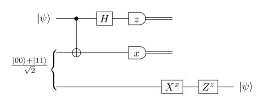

# Quantum-Teleportation

Hi There! 👋 
This is a repo where you have access to all the Jupiter Notebooks, along with some resources that made it all possible! 

## Table of Contents
* [Quantum Teleportation?](#Quantum-Teleportation?)
* [Diabetic Retinopathy](#Diabetic-Retinopathy)
* [Acknowledgements](#Acknowledgements)
* [Connect with me](#Connect-with-me)

## Quantum Teleportation?

### TL;DR 
Straight off the bat: quantum teleportation isn't really teleportation. What happens is the state of the qubit is transferred to another qubit. To understand let's run through a scenario. 

Let's say we have 2 labs: Lab A and Lab B. Lab A has a qubit that they want to transfer to Lab B. Lab A has no idea what state the mysterious qubit is in. So how do we do it?

One option would be to physically transfer the qubit. But that's boring! We want to do cool things so we'll move on. Another proposal would be to try and measure the state of the qubit - but that's not possible too because of the no-cloning theorem! 

What do we do?

Quantum Teleportation!

### A Longer Explanation:

 
Credit: Quantum.Country

Now it might look a bit complicated, but if you think about it, with only 3 qubits and 6 gates we can perform quantum teleportation! 

Part of the Circuit
- The first 2 lanes are Lab A
- The last lane is Lab B
- The very first lane is the qubit that we'll be teleporting

How the Circuit Works
- An entangled pair of qubits (Qubit 2 and 3) are sent to each lab
- A CNOT gate has a target of Qubit 2 with a control of Qubit 1
- A Hadamard gate is applied to Qubit 1
- Qubit 1 and 2 are measured. With a z gate and x gate respectively
- At this moment, Qubit 3 becomes Qubit 1 (but we need to modify it a bit)
- Depending on the outputs of Qubit 1 and 2, we rotate Qubit 3
- Success! The qubit is successfully teleported!

Alright! We just performed quantum teleportation. Now the reason why it's teleported at step 5 is that Qubit 2 and 3 are entangled. But if that answer isn't satisfactory enough, let's get into the math!

## Acknowledgements

* [Understanding LSTM Networks by Christopher Olah - A wonderful guide to LSTMs](https://colah.github.io/posts/2015-08-Understanding-LSTMs/)
* [Reserach Paper that details the history, evolution and math of LSTMs](https://arxiv.org/pdf/1909.09586.pdf)
* [Illustrated Guide to LSTM’s and GRU’s: A step by step explanation](https://towardsdatascience.com/illustrated-guide-to-lstms-and-gru-s-a-step-by-step-explanation-44e9eb85bf21)
* [The Dataset I used](https://www.kaggle.com/shahir/protein-data-set/notebooks)
* [Resource that helped me code](https://towardsdatascience.com/lstm-text-classification-using-pytorch-2c6c657f8fc0)
* [Resource that helped me code](https://www.analyticsvidhya.com/blog/2020/01/first-text-classification-in-pytorch/)
* [Resource that helped me code](https://huggingface.co/Rostlab/prot_bert)
* [Resource that explains the importance](https://arxiv.org/ftp/arxiv/papers/1701/1701.08318.pdf)
* [Resource that explains the importance](https://www.nature.com/articles/nrm2281)
* [Resource that explains the importance](https://www.newscientist.com/article/2194516-we-dont-know-what-a-fifth-of-our-genes-do-and-wont-find-out-soon/)
* [Resource that explains the importance](https://news.mit.edu/2019/machine-learning-amino-acids-protein-function-0322)
* [Resource that explains the importance](https://www.frontiersin.org/articles/10.3389/fbioe.2020.00391/full)

## Connect with me

If you want to follow along on my journey, you can join my [monthly newsletter](https://www.subscribepage.com/g1p8w4), check out my [website](https://dicksonwu654.github.io/), and connect on [Linkedin](https://www.linkedin.com/in/real-dickson-wu/) or [Twitter](https://twitter.com/DicksonWu3) 😃
